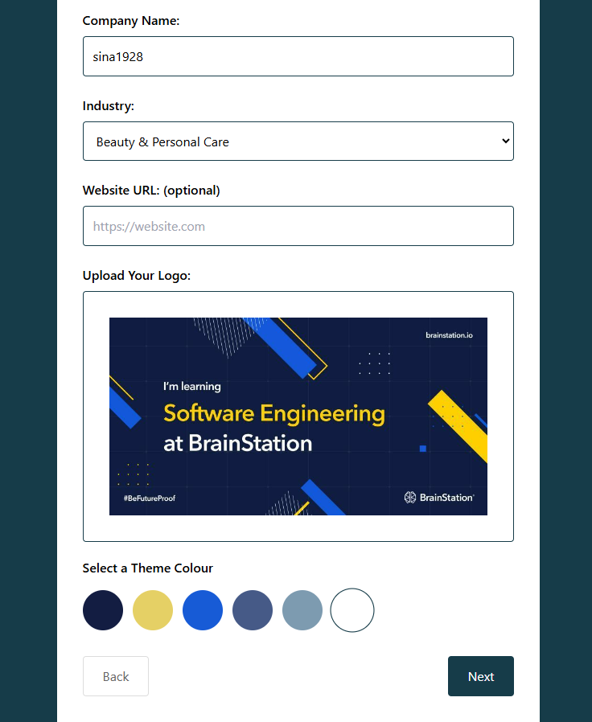

# wrkflw (pronounced as "workflow") - All-in-One Business Management Platform

## Overview

wrkflw is a customizable business management platform designed for independent contractors and small to medium-sized businesses. It integrates essential business functions including project management, employee management, time tracking, invoicing, and more into a user-friendly interface.

### Problem Space

Small businesses and independent contractors often struggle with fragmented tools for managing their operations. Existing solutions are either too complex, too expensive, or lack the flexibility to adapt to diverse business requirements.

### User Profile

wrkflw targets:
• Small business owners
• Independent contractors
• Project managers
• HR professionals
• Sales teams

wrkflw is utilized for daily operations, project tracking, employee management, and client relations. The app must be intuitive for non-technical users while providing advanced features for power users. It should be accessible on both desktop and mobile devices, with a responsive design to accommodate various screen sizes and accomodate for different accesability concerns.

### Features

1. User Authentication and Profile Management
   ◦ As a user, I can securely sign up and log in to the platform
   ◦ As a business owner, I can manage my company or switch to other companies I have registered under my login credentials
2. Dashboard
   ◦ As a manager, I can view key business metrics at a glance

3. Industry-Specific Template Library
   ◦ As a user, I can access and customize templates relevant to my industry in the onboarding process

## Implementation

### Tech Stack

• Frontend: React.js typescript
• Backend: Node.js with Express.js
• Database: MySQL for structured data, MongoDB for unstructured data
• UI Component Library: Shadcn ui
• Authentication: JWT with OAuth 2.0 for Google

### APIs

Google

### Sitemap

• Landing Page
• Leads to Login/Signup
• Dashboard (Main hub after login)

### Screenshots

### Data

Key Relationships:

1. Users, Industries, and Components are independent.
2. Users & Companies have a many-to-many relationship, so there is a user_company because companies have many users and users can belong to many companies
3. Companies belong to industries, so there is an industry_id in the companies table as a foreign key
4. Business requirements are related to industries so there is also an industry_id in the business requirements table
5. Components are related to business requirements there is also a business_requirements_components junction table
   

### Endpoints

Authentication
• POST /api/auth/signup

• POST /api/auth/login

## Roadmap

• Set up project structure and development environment
• Implement user authentication and business profile management
• Develop basic dashboard structure
• Implement role-based access control
• Develop industry-specific template library
Conduct thorough testing of all features
Optimize performance and fix bugs
Finalize documentation and help resources
Deployment

---

## Future Implementations

• CRM/Sales Functionality, Marketing, contract management, document management, employee training
• Multi-language support and localization
• AI-powered insights and recommendations for project management
• Advanced analytics and business intelligence tools with predictive capabilities
• Expanded marketplace for third-party add-ons/integrations
• Mobile app for iOS and Android with offline capabilities
• Blockchain integration for secure document verification and smart contracts
• Augmented Reality (AR) features for interactive training modules and project updates/time tracking updates
• Natural Language Processing for automated email response suggestions in CRM
• Integration with IoT devices for advanced time tracking and workplace management
• Advanced data visualization tools for complex projects and resource allocation
◦ As an admin, I can customize dashboard widgets based on my role and preferences

3. Advanced Project Management
   ◦ As a project manager, I can create and manage projects with multiple view options (Gantt, Kanban, List)
   ◦ As a team member, I can update task status and track progress
4. Employee Directory and Management
   ◦ As an HR manager, I can add and manage employee information
   ◦ As an admin, I can set role-based access controls for different user types
   ◦ As an admin, I can create and share new templates within my organization
5. Reporting and Analytics
   ◦ As a manager, I can generate reports on project status, document usage, and business performance
   ◦ As an executive, I can view customized dashboards for high-level insights
6. Time Tracking, Timesheets and Invoicing
   ◦ As an employee, I can log my work hours against specific projects or tasks and I can review/submit my own timesheet
   ◦ As a manager, I can generate invoices based on tracked time and project milestones
7. Custom Form Builder
   ◦ As a manager/admin, I can create custom forms using a drag-and-drop interface

8. Payroll Management
   • As a finance manager, I can process payroll for employees based on their time entries and salary information
   • As an employee, I can view my pay stubs and tax information
   • As an admin, I can set up payroll schedules and tax withholding rules
   • As a manager, I can approve overtime and bonus payments
